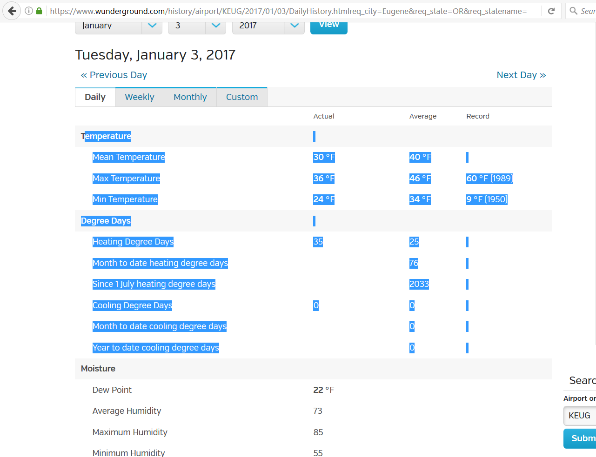
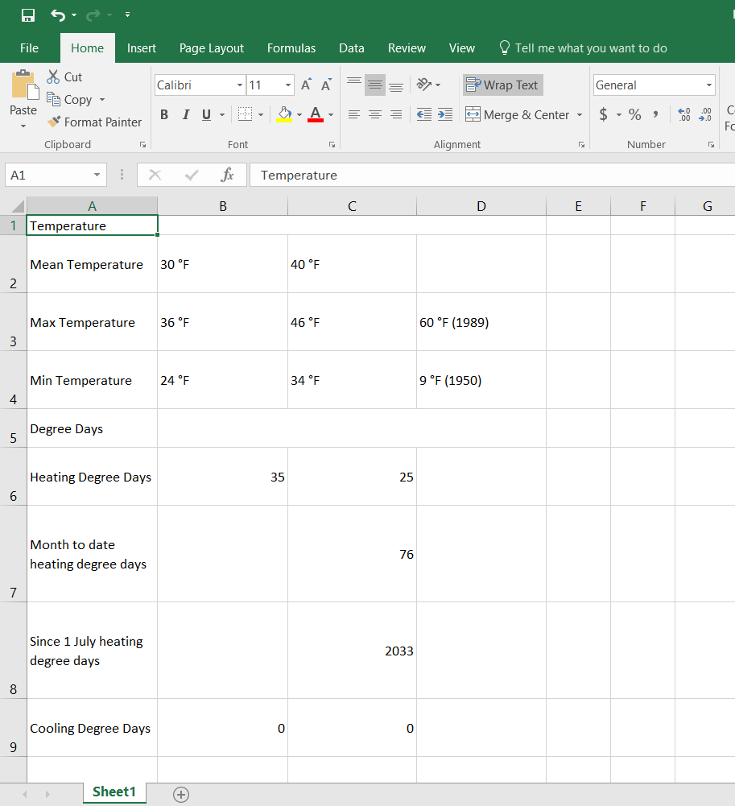
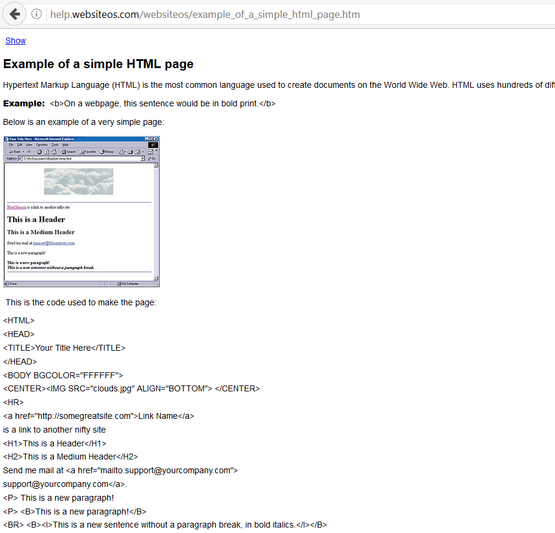
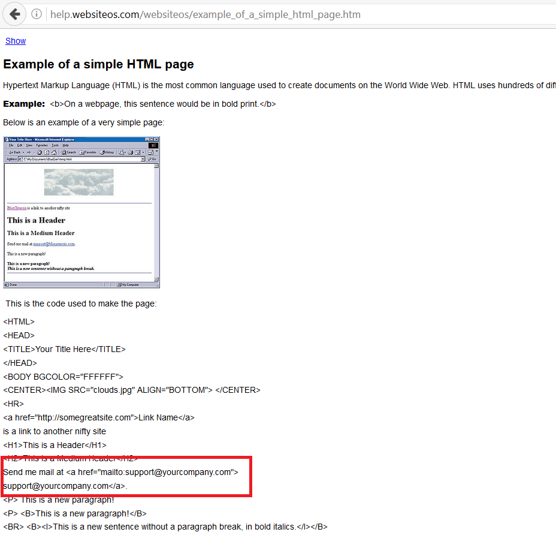
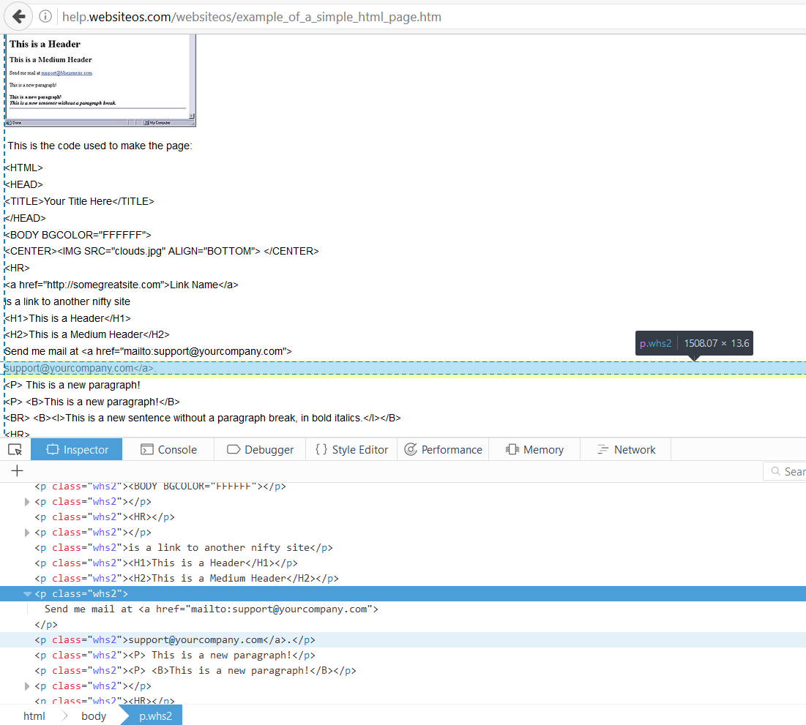

# WebScraping
Tutorial and worked example for webscraping in python using urlopen from urllib.request, beautifulsoup, and pandas

# 1 Paragraph on Web Scraping
If there's information on a webpage, you can gather it. If you only want information from a few pages, you can just copy/paste into an excel file and be on your way. 

     

But if there are many pages, that's just not practicle. Either you need a lot of people to help you, or you need to have your computer do it for you. This webscraper will be written in a Jupyter Python notebook, and in essense does exactly what a human would do: open a webpage, copy the desired information, save it in a table, and repeat for many, many pages.

## Keys to Web Scraping:
<b>The keys to web scraping are patterns. The webpages you want the program to visit can't be random, there needs to be some pattern the program can follow to go from one to the next. The desired data on each webpage must be in some recognizable pattern, so the web scraper can reliably collect it. Finding these patterns is the tricky, time consuming process that is at the very beginning. But after they're discovered, writing the code of the web scraper is easy.</b>

## Simple Web Scraping Outline

In fake code, this is what this web scraper looks like:

```text
for x in range(0,however many pages you're looking at):
  
  1. download HTMl from url="https://www.desired-web-site.com/page=%s" % (x)
  
  2. locate in HTML the section with desired information
  
  3. record information in dataframe saved locally to computer
```

Each of these steps would take many, many lines of code. Thankfully, there are python packages that other, brilliant people have created. All I have to do is download those packages (Anaconda has many of them already. If not, Pip or Pip3 are good ways to acquire packages), and use them. For this web scraper we'll make use of three.

## Python Packages

1) urlopen from urllib.request : to download page contents from a given valid url

2) BeautifulSoup from bs4 : to navigate the HTML of the downloaded page

3) pandas : to store our scraped data

## Test Page
For the purposes of this little tutorial, I'll show how to scrape just a single page. One with very simple html to make it easier to understand what's going on: <a href="http://help.websiteos.com/websiteos/example_of_a_simple_html_page.htm">This page</a>



Before I writing the web scraper in Python, let me decide what I actually want to scrape. This page has minimal information, but as an example,  let's say I want the email address:



# urlopen from urllib.request

urlopen is a no-frills way of making a web scraper, and the receipe is simple: (1) Give urlopen a valid url. (2) Watch as urlopen downloads the HTML from that url.
```python
from urllib.request import urlopen
url='http://help.websiteos.com/websiteos/example_of_a_simple_html_page.htm'
html=urlopen(url)
print(html)
```
If you fed urlopen a valid url, you should print something along the lines of: 
```python
<http.client.HTTPResponse object at many-numbers-and-letters>
```
## Downloading many pages

Doing this for just 1 page makes no sense. But often the pages you'll want to scrape have some pattern in their urls. For example, if they are daily records of weather, they might have the date in the url directly:

>https://www.wunderground.com/history/airport/KEUG/2016/01/05/DailyHistory.htmlreq_city=Eugene&req_state=OR&req_statename=Oregon&reqdb.zip=97404&reqdb.magic=1&reqdb.wmo=99999

>https://www.wunderground.com/history/airport/KEUG/2016/01/04/DailyHistory.htmlreq_city=Eugene&req_state=OR&req_statename=Oregon&reqdb.zip=97404&reqdb.magic=1&reqdb.wmo=99999

So, you could visit many of these pages by writing a python script that created knew url strings by changing the date.

Example, downloading the html of every day in Jan, 2016:
```python
for x in range(1,32):
	url="https://www.wunderground.com/history/airport/KEUG/2016/01/%s/DailyHistory.htmlreq_city=Eugene&req_state=OR&req_statename=Oregon&reqdb.zip=97404&reqdb.magic=1&reqdb.wmo=99999" % (x)
	html=urlopen(url)
```
Another possibility is that you need to interact with the website to get the information (click a javascript button, for example). Requests can't do that. Look into something like Selenium if you need to interact with the page.

# 1 BeautifulSoup
So now you have the html from the page, but no way of reading it. Cue BeautifulSoup. BeautifulSoup will do 2 major things for us. (1) It will decode the html into something we can read in the python script. (2) It will let us navigate through the many lines of html by making use of the tags and labels of html coding.

```python
from bs4 import BeautifulSoup
soup=BeautifulSoup(html.read(),'lxml')
print(soup)
```
Of course, html is terrible to look through. See if you can find the email address in all this:
```html
<!DOCTYPE doctype HTML public "-//W3C//DTD HTML 4.0 Frameset//EN">

<!-- saved from url=(0014)about:internet -->
<html>
<head>
<meta content="text/html;charset=utf-8" http-equiv="content-type">
<title>Example of a simple HTML page</title>
<meta content="Adobe RoboHelp - www.adobe.com" name="generator">
<link href="default_ns.css" rel="stylesheet"><script language="JavaScript" title="WebHelpSplitCss" type="text/javascript">
<!--
if (navigator.appName !="Netscape")
{   document.write("<link rel='stylesheet' href='default.css'>");}
//-->
</script>
<style type="text/css">
<!--
img_whs1 { border:none; width:301px; height:295px; float:none; }
p.whs2 { margin-bottom:5pt; }
p.whs3 { margin-bottom:9.5pt; }
-->
</style><script language="JavaScript" title="WebHelpInlineScript" type="text/javascript">
<!--
function reDo() {
  if (innerWidth != origWidth || innerHeight != origHeight)
     location.reload();
}
if ((parseInt(navigator.appVersion) == 4) && (navigator.appName == "Netscape")) {
	origWidth = innerWidth;
	origHeight = innerHeight;
	onresize = reDo;
}
onerror = null; 
//-->
</script>
<style type="text/css">
<!--
div.WebHelpPopupMenu { position:absolute; left:0px; top:0px; z-index:4; visibility:hidden; }
p.WebHelpNavBar { text-align:left; }
-->
</style><script language="javascript1.2" src="whmsg.js" type="text/javascript"></script>
<script language="javascript" src="whver.js" type="text/javascript"></script>
<script language="javascript1.2" src="whproxy.js" type="text/javascript"></script>
<script language="javascript1.2" src="whutils.js" type="text/javascript"></script>
<script language="javascript1.2" src="whtopic.js" type="text/javascript"></script>
<script language="javascript1.2" type="text/javascript">
<!--
if (window.gbWhTopic)
{
	if (window.setRelStartPage)
	{
	addTocInfo("Building your website\nCreating an EasySiteWizard 6 website\nExample of a simple HTML page");
addButton("show",BTN_TEXT,"Show","","","","",0,0,"whd_show0.gif","whd_show2.gif","whd_show1.gif");
addButton("hide",BTN_TEXT,"Hide","","","","",0,0,"whd_hide0.gif","whd_hide2.gif","whd_hide1.gif");
addButton("synctoc",BTN_TEXT,"Show Topic in Contents","","","","",0,0,"whd_sync0.gif","whd_sync2.gif","whd_sync1.gif");

	}


	if (window.setRelStartPage)
	{
	setRelStartPage("websiteos.html");

		autoSync(0);
		sendSyncInfo();
		sendAveInfoOut();
	}

}
else
	if (window.gbIE4)
		document.location.reload();
//-->
</script>
</link></meta></meta></head>
<body><script language="javascript1.2" type="text/javascript">
<!--
if (window.writeIntopicBar)
	writeIntopicBar(1);
//-->
</script>
<h1>Example of a simple HTML page</h1>
<p>Hypertext Markup Language (HTML) is the most common language used to 
 create documents on the World Wide Web. HTML uses hundreds of different 
 tags to define a layout for web pages. Most tags require an opening &lt;tag&gt; 
 and a closing &lt;/tag&gt;.</p>
<p><span style="font-weight: bold;"><b>Example:</b></span>  &lt;b&gt;On 
 a webpage, this sentence would be in bold print.&lt;/b&gt; </p>
<p>Below is an example of a very simple page: </p>
<p></p>
<p> This 
 is the code used to make the page: </p>
<p class="whs2">&lt;HTML&gt; </p>
<p class="whs2">&lt;HEAD&gt; </p>
<p class="whs2">&lt;TITLE&gt;Your Title Here&lt;/TITLE&gt; 
 </p>
<p class="whs2">&lt;/HEAD&gt; </p>
<p class="whs2">&lt;BODY BGCOLOR="FFFFFF"&gt; 
 </p>
<p class="whs2">&lt;CENTER&gt;&lt;IMG SRC="clouds.jpg" 
 ALIGN="BOTTOM"&gt; &lt;/CENTER&gt; </p>
<p class="whs2">&lt;HR&gt; </p>
<p class="whs2">&lt;a href="http://somegreatsite.com"&gt;Link 
 Name&lt;/a&gt; </p>
<p class="whs2">is a link to another nifty site </p>
<p class="whs2">&lt;H1&gt;This is a Header&lt;/H1&gt; </p>
<p class="whs2">&lt;H2&gt;This is a Medium Header&lt;/H2&gt; 
 </p>
<p class="whs2">Send me mail at &lt;a href="mailto:support@yourcompany.com"&gt;</p>
<p class="whs2">support@yourcompany.com&lt;/a&gt;. </p>
<p class="whs2">&lt;P&gt; This is a new paragraph! </p>
<p class="whs2">&lt;P&gt; &lt;B&gt;This is a new paragraph!&lt;/B&gt; 
 </p>
<p class="whs2">&lt;BR&gt; &lt;B&gt;&lt;I&gt;This is a new 
 sentence without a paragraph break, in bold italics.&lt;/I&gt;&lt;/B&gt; 
 </p>
<p class="whs2">&lt;HR&gt; </p>
<p class="whs2">&lt;/BODY&gt; </p>
<p class="whs2">&lt;/HTML&gt; </p>
<p class="whs2"> </p>
<p class="whs2"> </p>
<p class="whs3"> </p>
<script language="javascript1.2" type="text/javascript">
<!--
if (window.writeIntopicBar)
	writeIntopicBar(0);
//-->
</script>
</body>
</html>

```
The above html is from a very simple webpage. Most pages you'll want to scrape are much more complex and sorting through them can be a chore. It's a tedius step that all writers of web scrapers must suffer through. You can make your life easier by figuring out where the information you want is located within the html of the webpage when it's open in your browser.

## Inspect element to locate the html tags
In Firefox, right click on the information you care about and select 'inspect element.' The browser will let you look under the hood at the html of the page and take you right to the section you care about. (Other browsers have a similar feature.)

 

Here I can note all the html tags I can use to locate the email address with BeautifulSoup:

It's in a paragraph ('p'). It has a class ('whs2'). And the address is in a link (< a > < /a >).

That's more than enough for BeautifulSoup.

## Navigating with BeautifulSoup
There are a lot of tools in BeautifulSoup, but we'll make do with three: <b>find</b>, <b>find_all</b>, and <b>contents</b>. There's much, much more you can do, of course. Listed <a href="https://www.crummy.com/software/BeautifulSoup/bs4/doc/">here</a>.

<b>find</b> gives the first instance of some html tag:
```python
soup.find('p')
```
```html
<p>Hypertext Markup Language (HTML) is the most common language used to 
 create documents on the World Wide Web. HTML uses hundreds of different 
 tags to define a layout for web pages. Most tags require an opening &lt;tag&gt; 
 and a closing &lt;/tag&gt;.</p>
 ```
 <b>contents</b> gives you any text what find found in the form of a list:
 ```python
 soup.find('p').contents
 ```
 ```text
 ['Hypertext Markup Language (HTML) is the most common language used to \n create documents on the World Wide Web. HTML uses hundreds of different \n tags to define a layout for web pages. Most tags require an opening <tag> \n and a closing </tag>.']
 ```
<b>find_all</b> returns every instance of that tag. Again, in a list:
 ```python
 soup.find_all('p')
 ```
 ```html
 [<p>Hypertext Markup Language (HTML) is the most common language used to 
  create documents on the World Wide Web. HTML uses hundreds of different 
  tags to define a layout for web pages. Most tags require an opening &lt;tag&gt; 
  and a closing &lt;/tag&gt;.</p>,
 <p><span style="font-weight: bold;"><b>Example:</b></span>  &lt;b&gt;On 
  a webpage, this sentence would be in bold print.&lt;/b&gt; </p>,
 <p>Below is an example of a very simple page: </p>,
 <p></p>,
 <p> This 
  is the code used to make the page: </p>,
 <p class="whs2">&lt;HTML&gt; </p>,
 <p class="whs2">&lt;HEAD&gt; </p>,
 <p class="whs2">&lt;TITLE&gt;Your Title Here&lt;/TITLE&gt; 
  </p>,
 <p class="whs2">&lt;/HEAD&gt; </p>,
 <p class="whs2">&lt;BODY BGCOLOR="FFFFFF"&gt; 
  </p>,
 <p class="whs2">&lt;CENTER&gt;&lt;IMG SRC="clouds.jpg" 
  ALIGN="BOTTOM"&gt; &lt;/CENTER&gt; </p>,
 <p class="whs2">&lt;HR&gt; </p>,
 <p class="whs2">&lt;a href="http://somegreatsite.com"&gt;Link 
  Name&lt;/a&gt; </p>,
 <p class="whs2">is a link to another nifty site </p>,
 <p class="whs2">&lt;H1&gt;This is a Header&lt;/H1&gt; </p>,
 <p class="whs2">&lt;H2&gt;This is a Medium Header&lt;/H2&gt; 
  </p>,
 <p class="whs2">Send me mail at &lt;a href="mailto:support@yourcompany.com"&gt;</p>,
 <p class="whs2">support@yourcompany.com&lt;/a&gt;. </p>,
 <p class="whs2">&lt;P&gt; This is a new paragraph! </p>,
 <p class="whs2">&lt;P&gt; &lt;B&gt;This is a new paragraph!&lt;/B&gt; 
  </p>,
 <p class="whs2">&lt;BR&gt; &lt;B&gt;&lt;I&gt;This is a new 
  sentence without a paragraph break, in bold italics.&lt;/I&gt;&lt;/B&gt; 
  </p>,
 <p class="whs2">&lt;HR&gt; </p>,
 <p class="whs2">&lt;/BODY&gt; </p>,
 <p class="whs2">&lt;/HTML&gt; </p>,
 <p class="whs2"> </p>,
 <p class="whs2"> </p>,
 <p class="whs3"> </p>]
 ```
 If the html object also has a class, you can narrow your results even further:
 ```python
 soup.find_all('p', class_='whs2')
 ```
 ```html
 [<p class="whs2">&lt;HTML&gt; </p>,
 <p class="whs2">&lt;HEAD&gt; </p>,
 <p class="whs2">&lt;TITLE&gt;Your Title Here&lt;/TITLE&gt; 
  </p>,
 <p class="whs2">&lt;/HEAD&gt; </p>,
 <p class="whs2">&lt;BODY BGCOLOR="FFFFFF"&gt; 
  </p>,
 <p class="whs2">&lt;CENTER&gt;&lt;IMG SRC="clouds.jpg" 
  ALIGN="BOTTOM"&gt; &lt;/CENTER&gt; </p>,
 <p class="whs2">&lt;HR&gt; </p>,
 <p class="whs2">&lt;a href="http://somegreatsite.com"&gt;Link 
  Name&lt;/a&gt; </p>,
 <p class="whs2">is a link to another nifty site </p>,
 <p class="whs2">&lt;H1&gt;This is a Header&lt;/H1&gt; </p>,
 <p class="whs2">&lt;H2&gt;This is a Medium Header&lt;/H2&gt; 
  </p>,
 <p class="whs2">Send me mail at &lt;a href="mailto:support@yourcompany.com"&gt;</p>,
 <p class="whs2">support@yourcompany.com&lt;/a&gt;. </p>,
 <p class="whs2">&lt;P&gt; This is a new paragraph! </p>,
 <p class="whs2">&lt;P&gt; &lt;B&gt;This is a new paragraph!&lt;/B&gt; 
  </p>,
 <p class="whs2">&lt;BR&gt; &lt;B&gt;&lt;I&gt;This is a new 
  sentence without a paragraph break, in bold italics.&lt;/I&gt;&lt;/B&gt; 
  </p>,
 <p class="whs2">&lt;HR&gt; </p>,
 <p class="whs2">&lt;/BODY&gt; </p>,
 <p class="whs2">&lt;/HTML&gt; </p>,
 <p class="whs2"> </p>,
 <p class="whs2"> </p>]
 ```
Finally, because html elements returned by find_all are in a list, you can iterate through them:
```python
subSoup=soup.find_all('p',class_='whs2');
for elm in subSoup:
    print(elm.contents)
```
```text
['<HTML> ']
['<HEAD> ']
['<TITLE>Your Title Here</TITLE> \n ']
['</HEAD> ']
['<BODY BGCOLOR="FFFFFF"> \n ']
['<CENTER> </CENTER> ']
['<HR> ']
['<a href="http://somegreatsite.com">Link \n Name</a> ']
['is a link to another nifty site ']
['<H1>This is a Header</H1> ']
['<H2>This is a Medium Header</H2> \n ']
['Send me mail at <a href="mailto:support@yourcompany.com">']
['support@yourcompany.com</a>. ']
['<P> This is a new paragraph! ']
['<P> <B>This is a new paragraph!</B> \n ']
['<BR> <B><I>This is a new \n sentence without a paragraph break, in bold italics.</I></B> \n ']
['<HR> ']
['</BODY> ']
['</HTML> ']
['\xa0']
['\xa0']
```

Using this and a bit of python knowledge, we can pull out the email address:
```python
subSoup=soup.find_all('p',class_='whs2');
for elm in subSoup:
    ret=elm.contents[0]
    if '<a href' in ret and '@' in ret:
        print("The contents of html object with the email address: %s" % (ret))
        email=ret[25+len('mailto')+1:-2]
        print("a chunky bit of python string processing gives us just the email: %s" % (email))
```
```text
The contents of html object with the email address: Send me mail at <a href="mailto:support@yourcompany.com">
a chunky bit of python string processing gives us just the email: support@yourcompany.com
```

# Saving the information in a DataFrame (Pandas)

If we scraped many more websites and took more data from each page than just a single email address, we'd want to save it all someplace easy to access in the future. (Printing 10,000 items in a Python notebook is a terrible idea.)

There are many ways to do this, but let's focus on creating a DataFrame (think Excel table) using Pandas. Why? Because Pandas is really useful in data science for doing exploritory data analysis, parallel processing, sorting/ cleaning/ and reformating data, etc. It's easier to save the data into a Pandas DataFrame right from the start than to have to transcribe it in later.

First, of course, you'll need to import Pandas:
```python
import pandas as pd
```
You can then initialize an empty DataFrame:
```python
df=pd.DataFrame()
```
(Note: Do this outside of any for loops you have going on!)

If you already know the names of the columns you'll want, you can assign that now:
```python
df=pd.DataFrame(columns=['emails'])
```
<table border="1">
<tr>
<td>Emails</td>
</tr>
</table>

Now that we have a column, we can add the data to the DataFrame in the form of a list:
```python
df=pd['Emails']=[email])
```
<table border="1">
<tr>
<td></td><td>Emails</td>
</tr>
<tr>
<td>0</td><td>support@yourcompany.com</td>
</tr>
</table>

(This would be more impressive if we had more than 1 email to put into the DataFrame.)

If we had a second email (say: support2@yourcompany.com), we could append it to the DataFrame by stating the row and column it should be added to:
```python
df.loc[1,'Emails']='support2@yourcompany.com'
```
<table border="1">
<tr>
<td></td><td>Emails</td>
</tr>
<tr>
<td>0</td><td>support@yourcompany.com</td>
</tr>
<tr>
<td>1</td><td>support2@yourcompany.com</td>
</tr>
</table>

In this way, each time our web scraper goes to a new page and scrapes the desired data, we can save it in the next row of the DataFrame.

After the scraping is complete, you can save to csv file with:
```python
df.to_csv('Scraped_emails.csv',index=False)
```
And later import it directly into a DataFrame with:

```python
df=pd.read_csv('Scraped_emails.csv')
```

# Try yourself:
Want practice at this? Try it yourself. Write a Python script using the modules shown here to scrape and save the mean daily temperature for Eugene OR from Jan 01, 2016 to Jan 31, 2016 from <a href="https://www.wunderground.com/history/airport/KEUG/2016/1/1/DailyHistory.html?req_city=&req_state=&req_statename=&reqdb.zip=&reqdb.magic=&reqdb.wmo=">this site </a>
